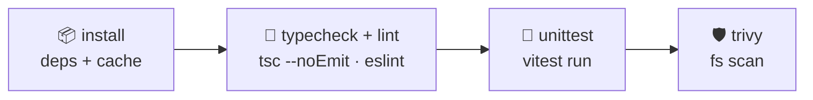
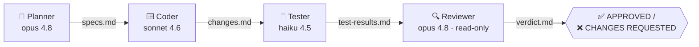

# vnstock-web

A [Next.js](https://nextjs.org) (App Router) web application, bootstrapped with `create-next-app` and hardened with a typed test suite, a formatter + linter split, git hooks, and a PR-gated CI pipeline.

> **Note for contributors and AI agents:** this repo tracks a **modified build of Next.js** — APIs and conventions may differ from upstream. Before writing Next.js code, read the local guides in `node_modules/next/dist/docs/`. See [`AGENTS.md`](AGENTS.md).

---

## Tech stack

| Layer | Tool | Version |
|---|---|---|
| Framework | **Next.js** (App Router) | `16.2.10` |
| UI library | **React** | `19.2.4` |
| Language | **TypeScript** (strict) | `^5` |
| Styling | **Tailwind CSS** (via `@tailwindcss/postcss`) | `^4` |
| Runtime | **Node.js** | `24.18.0` (CI-pinned; engines `>=24.0.0`) |
| Package manager | **pnpm** | `9.7.0` |
| Formatter | **Biome** (format only — linter disabled) | `2.5.4` |
| Linter | **ESLint** + `eslint-config-next` | `^9` / `16.2.10` |
| Testing | **Vitest** + **Testing Library** + **jsdom** | `^4.1.10` |
| Git hooks | **Lefthook** | `^2.1.10` |
| CI security scan | **Trivy** (`aquasecurity/trivy-action`) | `@0.28.0` |

---

## Architecture

```
vnstock-web/
├─ .github/
│  ├─ actions/setup-deps/action.yml   # composite: pnpm + Node 24.18.0 + node_modules cache
│  └─ workflows/ci.yml                # PR-to-master CI: install → typecheck → unittest → trivy
├─ .claude/
│  ├─ agents/                         # dev-team pipeline subagents (planner/coder/tester/reviewer)
│  ├─ commands/pipeline.md            # /pipeline orchestrator
│  └─ settings.json                   # permission allowlist for dev commands
├─ src/
│  ├─ app/                            # Next.js App Router — layout.tsx, page.tsx, globals.css
│  ├─ lib/                            # framework-agnostic utilities (+ colocated *.test.ts)
│  └─ ci/                             # structural tests that assert the CI workflow is correct
├─ biome.json                         # formatter config (linter + CSS formatting disabled)
├─ eslint.config.mjs                  # eslint-config-next (core-web-vitals + typescript)
├─ lefthook.yml                       # git hooks: pre-commit (format/lint/typecheck), pre-push (test)
├─ vitest.config.ts / vitest.setup.ts # Vitest + jsdom + Testing Library setup
├─ AGENTS.md / CLAUDE.md              # agent guidance (modified-Next.js note)
└─ package.json
```

Conventions:

- **Tests are colocated** next to the code they cover as `*.test.ts` / `*.test.tsx` (e.g. `src/lib/format.ts` ↔ `src/lib/format.test.ts`).
- **Formatting and linting are separate concerns** — Biome owns formatting, ESLint owns linting; they don't overlap (see [Code quality](#code-quality)).

---

## Getting started

**Prerequisites:** Node.js `24.18.0` (the version CI runs) and pnpm `9.7.0` (declared via `packageManager`; `corepack enable` will provision it).

```bash
pnpm install        # installs deps AND sets up git hooks (via the `prepare` script)
pnpm dev            # start the dev server
```

Open [http://localhost:3000](http://localhost:3000). Edit `src/app/page.tsx`; the page hot-reloads.

### Scripts

| Script | Command | Purpose |
|---|---|---|
| `pnpm dev` | `next dev` | Dev server with hot reload |
| `pnpm build` | `next build` | Production build |
| `pnpm start` | `next start` | Serve the production build |
| `pnpm typecheck` | `tsc --noEmit` | Type-check the whole project |
| `pnpm test` | `vitest run` | Run the test suite once |
| `pnpm test:watch` | `vitest` | Run tests in watch mode |
| `pnpm lint` | `eslint` | Lint (ESLint / Next rules) |
| `pnpm lint:fix` | `eslint --fix` | Lint and auto-fix |
| `pnpm format` | `biome format --write .` | Format the repo |
| `pnpm format:check` | `biome format .` | Check formatting (no writes) |

---

## Code quality

Formatting and linting are handled by **two separate tools with no overlap**:

- **Biome — formatter only.** `biome.json` enables the formatter (2-space indent, 80-char width, double quotes) and **disables the linter** (`"linter": { "enabled": false }`) and CSS formatting. There is no Prettier in this repo — Biome replaces it.
- **ESLint — linter only.** `eslint.config.mjs` extends `eslint-config-next/core-web-vitals` and `.../typescript`, providing Next.js Core Web Vitals and TypeScript-aware rules. `eslint-config-next` carries **no formatting rules**, so it never conflicts with Biome (and `eslint-config-prettier` is unnecessary).

### Git hooks (Lefthook)

Hooks are installed automatically by the `prepare` script on `pnpm install`.

| Hook | Jobs |
|---|---|
| **pre-commit** | 1. **format** — Biome auto-formats staged files and **re-stages** them (`stage_fixed: true`). 2. **lint** (ESLint) + **typecheck** (`tsc`, project-wide) run in parallel on the formatted code. |
| **pre-push** | **test** — `vitest run`. |

> Formatting therefore runs on **every commit** and cannot land unformatted code locally. (Bypass with `LEFTHOOK=0 git commit …` is possible but discouraged.)

---

## Testing

- **Vitest** + **Testing Library** (`@testing-library/react`, `jest-dom`, `user-event`) on **jsdom**.
- Config: `vitest.config.ts`; global setup: `vitest.setup.ts`.
- Tests are **colocated** as `*.test.ts` / `*.test.tsx`.
- `src/ci/ci-workflow.test.ts` additionally asserts the CI workflow's structure (trigger, job graph, cache key, Trivy policy, Node pin) so CI config can't silently drift.

---

## CI / CD

`.github/workflows/ci.yml` runs on **every pull request targeting `master`** as four **independent, sequential jobs**, each gated on the previous succeeding:



- **Dependency reuse:** the `.github/actions/setup-deps` composite action sets up pnpm + Node `24.18.0`, then restores `node_modules` from an `actions/cache@v4` entry keyed on `hashFiles('pnpm-lock.yaml')` (with a `pnpm install --frozen-lockfile` fallback on a cache miss). `typecheck` and `unittest` reuse the install job's dependencies instead of reinstalling.
- **Security:** least-privilege `permissions: contents: read`; `pull_request` (not `pull_request_target`); Trivy scans the filesystem at `CRITICAL,HIGH` with `exit-code: 1` and `ignore-unfixed: true`, so new high-severity findings fail the check.
- Concurrency cancels superseded runs; all third-party actions are version-pinned.

---

## Dev-team pipeline (Claude Code)

This repo ships a **4-phase "dev team" pipeline** built from Claude Code subagents. Run it with `/pipeline <feature description>`; it drives four specialist subagents in strict order, each handing off to the next through files in `.pipeline/` (git-ignored scratch).



| Phase | Agent | Model | Responsibility | Output |
|---|---|---|---|---|
| 1 | **Planner** | `claude-opus-4-8` | Writes a detailed technical spec (types, file plan, ⚠️ edge cases). No code. | `.pipeline/specs.md` |
| 2 | **Coder** | `claude-sonnet-4-6` | Implements the spec with zero deviation; runs typecheck + format. | `.pipeline/changes.md` |
| 3 | **Tester** | `claude-haiku-4-5` | Writes + runs tests for the happy path, every ⚠️ edge case, and failure modes. | `.pipeline/test-results.md` |
| 4 | **Reviewer** | `claude-opus-4-8` | **Read-only** quality gate: verifies the diff vs. spec, security, and coverage. | `.pipeline/verdict.md` |

- Definitions live in `.claude/agents/*.md`; the orchestrator is `.claude/commands/pipeline.md`.
- `.claude/settings.json` holds a permission allowlist for common `pnpm` / `git` / `vitest` dev commands.
- Handoff files in `.pipeline/` are regenerated per run and are git-ignored.

This CI workflow itself was built by that pipeline.

---

## License

Private / unpublished (`"private": true`).
